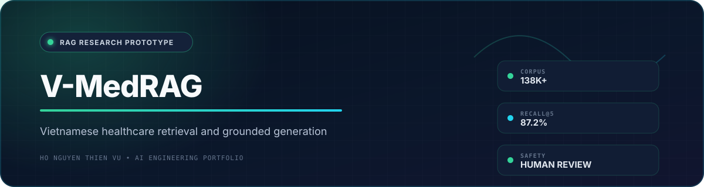
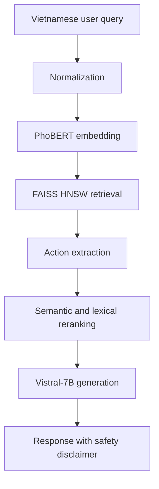

<div align="center">
  
  <br /><br />

  
  
  
  
  
</div>

> [!WARNING]
> V-MedRAG is a **research prototype**, not a medical device. It does not diagnose conditions, guarantee medical accuracy, or replace licensed clinicians. Human verification is required.

## Overview

**V-MedRAG** explores Vietnamese healthcare information retrieval and grounded response generation using Retrieval-Augmented Generation. It combines PhoBERT embeddings, FAISS HNSW retrieval, hybrid reranking, and Vistral-7B-Chat behind FastAPI and Django services.

<div align="center">
  <a href="https://drive.google.com/file/d/1HNeb-MCdKrV1TUTJ_UP5LpUCnQlSgYt_/view?usp=drive_link">
    
  </a>
</div>

## Research Snapshot

| Localized corpus | Semantic recall@5 | Action found rate | Specialty accuracy |
|---:|---:|---:|---:|
| **138,151 items** | **87.2%** | **>94.4%** | **52.0%** |

> Results are preliminary offline measurements at similarity threshold 0.65. Specialty accuracy is not sufficient for autonomous clinical triage.

## RAG Architecture



## Knowledge Base

| Source group | Items | Notes |
|---|---:|---|
| Medical articles | **77,917** | Long Chau 41,301; Vinmec 30,905; Tam Anh Hospital 5,105; Medlatec 606 |
| Patient-clinician Q&A | **60,234** | Covers major specialties including obstetrics, pediatrics, respiratory care, and dermatology |
| **Total** | **138,151** | Localized Vietnamese medical corpus |

The preprocessing pipeline includes PII removal and Vietnamese word segmentation with Underthesea. Corpus rights, privacy, and source freshness still require independent review before redistribution or production use.

## Pipeline Details

1. **Input processing** normalizes natural-language symptom descriptions.
2. **Embedding** maps the query to a 768-dimensional PhoBERT representation.
3. **Retrieval** searches the FAISS HNSW index for relevant passages.
4. **Action extraction** prioritizes passages containing actionable information.
5. **Hybrid reranking** combines semantic similarity with lexical overlap.
6. **Generation** injects selected context into Vistral-7B-Chat.

## Experimental Results

| Metric | Result | Interpretation |
|---|---:|---|
| Semantic recall@5 | **87.2%** | Relevant knowledge surfaced within the first five results |
| Semantic recall@10 | **89.6%** | Additional retrieval depth provides a smaller gain |
| Action found rate | **>94.4%** | Retrieved context frequently contains actionable passages |
| Specialty accuracy | **52.0%** | Requires human verification; unsuitable for autonomous routing |

Runtime defaults include 256-token chunks with 50-token overlap, temperature `0.8`, `top_p=0.92`, and `384` generated tokens. These settings do not guarantee factual correctness.

## Limitations and Safety

- Preliminary evaluation does not establish clinical safety.
- Specialty routing accuracy is limited to 52% in the reported experiment.
- Retrieval quality depends on preprocessing, corpus coverage, and source freshness.
- Retrieved context and lower sampling temperature cannot eliminate hallucinations.
- Emergency or high-risk medical situations must be handled by qualified professionals.
- Dataset redistribution and production deployment require legal, privacy, and medical-governance review.

## Quick Start

### 1. Install dependencies

```bash
git clone https://github.com/thiennvu1914/Healthcare_Recommendation_System.git
cd Healthcare_Recommendation_System/Source

pip install -r requirements.txt
cd web && pip install -r requirements.txt && cd ..
cp .env.example .env
```

Set `ENABLE_CACHE=1` and `ENABLE_LLM_GENERATION=1` in `.env` when the required local assets are available.

### 2. Start the FastAPI backend

```bash
cd Source
uvicorn api.main:app --host 0.0.0.0 --port 8000
```

API documentation: `http://localhost:8000/docs`

### 3. Start the Django interface

```bash
cd Source/web
python manage.py migrate
python manage.py runserver 0.0.0.0:8080
```

Web interface: `http://localhost:8080/ai-advisor/`

## API Example

```bash
curl -X POST http://localhost:8000/api/chat \
  -H "Content-Type: application/json" \
  -d '{"query":"Bé 3 tuổi bị sốt 39 độ thì nên làm gì?","include_sources":true}'
```

## Project Structure

```text
Healthcare_Recommendation_System/
└── Source/
    ├── api/                 # FastAPI RAG core
    │   ├── main.py
    │   ├── rag_engine.py
    │   ├── models.py
    │   └── config.py
    ├── web/                 # Django frontend
    ├── data/                # Processed chunks and embeddings
    ├── cache/               # FAISS HNSW index cache
    ├── scripts/             # Index rebuild utilities
    └── requirements.txt
```

## Medical Disclaimer

This software provides informational support only. It must not be used as the sole basis for diagnosis, treatment, emergency response, or clinical triage. Consult licensed healthcare professionals for medical decisions.
